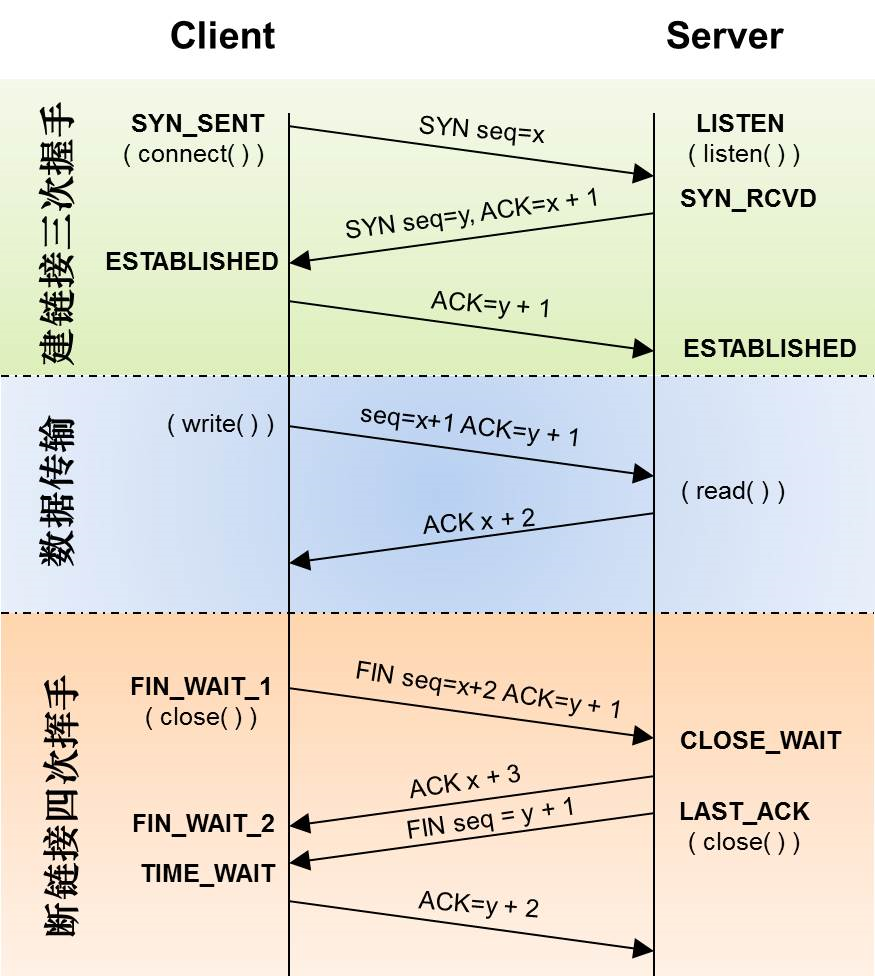

:::tip
Tcp连接和断开是面试常问的问题，tcpdump抓包看看
:::
#### Tcp包类型
- SYN:建立连接
- FIN:关闭连接
- ACK:响应
- PSH:传输数据
- RST:连接重置

#### 连接
```bash
14:24:15.989418 IP (tos 0x0, ttl 52, id 0, offset 0, flags [none], proto TCP (6), length 64)
    client-ip.61277 > server-ip.ddi-tcp-1: Flags [S], cksum 0x1d2c (correct), seq 2518143297, win 65535, options [mss 1250,nop,wscale 6,nop,nop,TS val 819085885 ecr 0,sackOK,eol], length 0
14:24:15.989455 IP (tos 0x0, ttl 64, id 0, offset 0, flags [DF], proto TCP (6), length 60)
    server-ip.ddi-tcp-1 > client-ip.61277: Flags [S.], cksum 0x8669 (correct), seq 2606895020, ack 2518143298, win 14480, options [mss 1460,sackOK,TS val 1608344423 ecr 819085885,nop,wscale 7], length 0
14:24:15.997765 IP (tos 0x0, ttl 52, id 0, offset 0, flags [none], proto TCP (6), length 52)
    client-ip.61277 > server-ip.ddi-tcp-1: Flags [.], cksum 0xe5bc (correct), ack 1, win 2050, options [nop,nop,TS val 819085892 ecr 1608344423], length 0
```
1. 客户端向服务端发送同步包Flags [S]，携带seq 2518143297，以及窗口大小win 65535;
2. 服务端回复同步和确认包Flags [S.]，携带seq 2606895020，ack 2518143298(2518143297 + 1)和窗口大小win 14480；
3. 客户端回复确认包Flags [.]，携带ack 1和窗口大小win 2050；
备注：这个ack=1，是因为tcpdump没有加参数S，如下
```text
-S --absolute-tcp-sequence-numbers
Print absolute, rather than relative, TCP sequence numbers.
```

#### 数据发送
```bash
14:24:24.831984 IP (tos 0x0, ttl 52, id 0, offset 0, flags [none], proto TCP (6), length 58)
    client-ip.61277 > server-ip.ddi-tcp-1: Flags [P.], cksum 0x53f6 (correct), seq 1:7, ack 1, win 2050, options [nop,nop,TS val 819094672 ecr 1608344423], length 6
14:24:24.832016 IP (tos 0x0, ttl 64, id 27844, offset 0, flags [DF], proto TCP (6), length 52)
    server-ip.ddi-tcp-1 > client-ip.61277: Flags [.], cksum 0xc257 (correct), ack 7, win 114, options [nop,nop,TS val 1608346634 ecr 819094672], length 0
14:24:36.827725 IP (tos 0x0, ttl 52, id 0, offset 0, flags [none], proto TCP (6), length 58)
    client-ip.61277 > server-ip.ddi-tcp-1: Flags [P.], cksum 0x1ab6 (correct), seq 7:13, ack 1, win 2050, options [nop,nop,TS val 819106597 ecr 1608346634], length 6
14:24:36.827747 IP (tos 0x0, ttl 64, id 27845, offset 0, flags [DF], proto TCP (6), length 52)
    server-ip.ddi-tcp-1 > client-ip.61277: Flags [.], cksum 0x8805 (correct), ack 13, win 114, options [nop,nop,TS val 1608349633 ecr 819106597], length 0
14:24:52.005287 IP (tos 0x0, ttl 52, id 54286, offset 0, flags [none], proto TCP (6), length 40)
    client-ip.61277 > server-ip.ddi-tcp-1: Flags [.], cksum 0x5524 (correct), ack 1, win 2050, length 0
14:24:52.005311 IP (tos 0x0, ttl 64, id 27846, offset 0, flags [DF], proto TCP (6), length 52)
    server-ip.ddi-tcp-1 > client-ip.61277: Flags [.], cksum 0x7933 (correct), ack 13, win 114, options [nop,nop,TS val 1608353427 ecr 819106597], length 0
14:24:53.878902 IP (tos 0x0, ttl 52, id 0, offset 0, flags [none], proto TCP (6), length 187)
    client-ip.61277 > server-ip.ddi-tcp-1: Flags [P.], cksum 0x020f (correct), seq 13:148, ack 1, win 2050, options [nop,nop,TS val 819123500 ecr 1608353427], length 135
14:24:53.878929 IP (tos 0x0, ttl 64, id 27847, offset 0, flags [DF], proto TCP (6), length 52)
    server-ip.ddi-tcp-1 > client-ip.61277: Flags [.], cksum 0x34c8 (correct), ack 148, win 122, options [nop,nop,TS val 1608353896 ecr 819123500], length 0
14:25:08.982845 IP (tos 0x0, ttl 52, id 48909, offset 0, flags [none], proto TCP (6), length 40)
    client-ip.61277 > server-ip.ddi-tcp-1: Flags [.], cksum 0x549d (correct), ack 1, win 2050, length 0
14:25:08.982858 IP (tos 0x0, ttl 64, id 27848, offset 0, flags [DF], proto TCP (6), length 52)
    server-ip.ddi-tcp-1 > client-ip.61277: Flags [.], cksum 0x2608 (correct), ack 148, win 122, options [nop,nop,TS val 1608357672 ecr 819123500], length 0
14:25:14.219314 IP (tos 0x0, ttl 52, id 0, offset 0, flags [none], proto TCP (6), length 57)
    client-ip.61277 > server-ip.ddi-tcp-1: Flags [P.], cksum 0xc9b4 (correct), seq 148:153, ack 1, win 2050, options [nop,nop,TS val 819143671 ecr 1608357672], length 5
14:25:14.219327 IP (tos 0x0, ttl 64, id 27849, offset 0, flags [DF], proto TCP (6), length 52)
    server-ip.ddi-tcp-1 > client-ip.61277: Flags [.], cksum 0xd21a (correct), ack 153, win 122, options [nop,nop,TS val 1608358981 ecr 819143671], length 0
14:25:14.219366 IP (tos 0x0, ttl 64, id 27850, offset 0, flags [DF], proto TCP (6), length 55)
    server-ip.ddi-tcp-1 > client-ip.61277: Flags [P.], cksum 0xd36b (correct), seq 1:4, ack 153, win 122, options [nop,nop,TS val 1608358981 ecr 819143671], length 3
14:25:14.226764 IP (tos 0x0, ttl 52, id 0, offset 0, flags [none], proto TCP (6), length 52)
    client-ip.61277 > server-ip.ddi-tcp-1: Flags [.], cksum 0xca88 (correct), ack 4, win 2050, options [nop,nop,TS val 819143678 ecr 1608358981], length 0
14:25:18.041153 IP (tos 0x0, ttl 52, id 0, offset 0, flags [none], proto TCP (6), length 54)
    client-ip.61277 > server-ip.ddi-tcp-1: Flags [P.], cksum 0xaec6 (correct), seq 153:155, ack 4, win 2050, options [nop,nop,TS val 819147436 ecr 1608358981], length 2
14:25:18.078312 IP (tos 0x0, ttl 64, id 27851, offset 0, flags [DF], proto TCP (6), length 52)
    server-ip.ddi-tcp-1 > client-ip.61277: Flags [.], cksum 0xbf9b (correct), ack 155, win 122, options [nop,nop,TS val 1608359946 ecr 819147436], length 0
14:25:18.082872 IP (tos 0x0, ttl 52, id 0, offset 0, flags [none], proto TCP (6), length 54)
    client-ip.61277 > server-ip.ddi-tcp-1: Flags [P.], cksum 0xae99 (correct), seq 153:155, ack 4, win 2050, options [nop,nop,TS val 819147481 ecr 1608358981], length 2
14:25:18.082893 IP (tos 0x0, ttl 64, id 27852, offset 0, flags [DF], proto TCP (6), length 64)
    server-ip.ddi-tcp-1 > client-ip.61277: Flags [.], cksum 0xb96f (correct), ack 155, win 122, options [nop,nop,TS val 1608359947 ecr 819147481,nop,nop,sack 1 {153:155}], length 0
```
1. 客户端发送数据和确认包Flags [P.]，seq为1:7, ack为1，窗口大小win为2050；
2. 服务端回复确认包Flags [.]，ack为7，窗口大小win为114；
3. 重复1-2步骤，序号逐渐递增，服务端向客户端发送数据同理；

#### 断连接

```bash
14:25:31.961335 IP (tos 0x0, ttl 52, id 0, offset 0, flags [none], proto TCP (6), length 52)
    client-ip.61277 > server-ip.ddi-tcp-1: Flags [F.], cksum 0x81f6 (correct), seq 155, ack 4, win 2050, options [nop,nop,TS val 819161287 ecr 1608359947], length 0
14:25:31.961389 IP (tos 0x0, ttl 64, id 27853, offset 0, flags [DF], proto TCP (6), length 52)
    server-ip.ddi-tcp-1 > client-ip.61277: Flags [F.], cksum 0x7bf0 (correct), seq 4, ack 156, win 122, options [nop,nop,TS val 1608363416 ecr 819161287], length 0
14:25:31.968710 IP (tos 0x0, ttl 52, id 0, offset 0, flags [none], proto TCP (6), length 52)
    client-ip.61277 > server-ip.ddi-tcp-1: Flags [.], cksum 0x745a (correct), ack 5, win 2050, options [nop,nop,TS val 819161301 ecr 1608363416], length 0
```
1. 客户端发送断连接和确认包Flags [F.]，seq=155,ack=4,win=2050;
2. 服务端发送断连接和确认包Flags [F.]，seq=4,ack=156,win=122;
3. 客户端发送确认包Flags [.]，ack=5,win=2050;

#### 过程图



