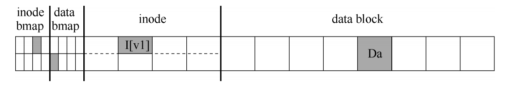
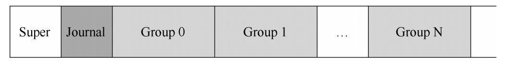
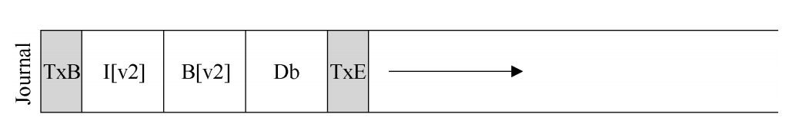
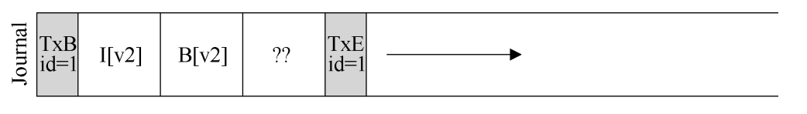
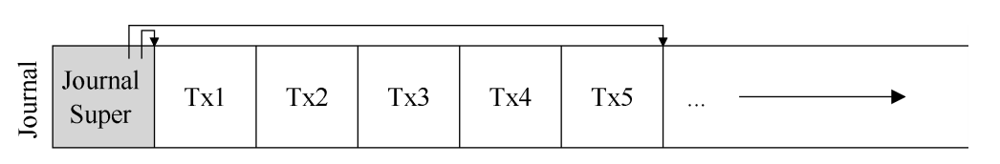
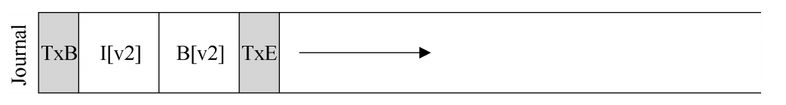
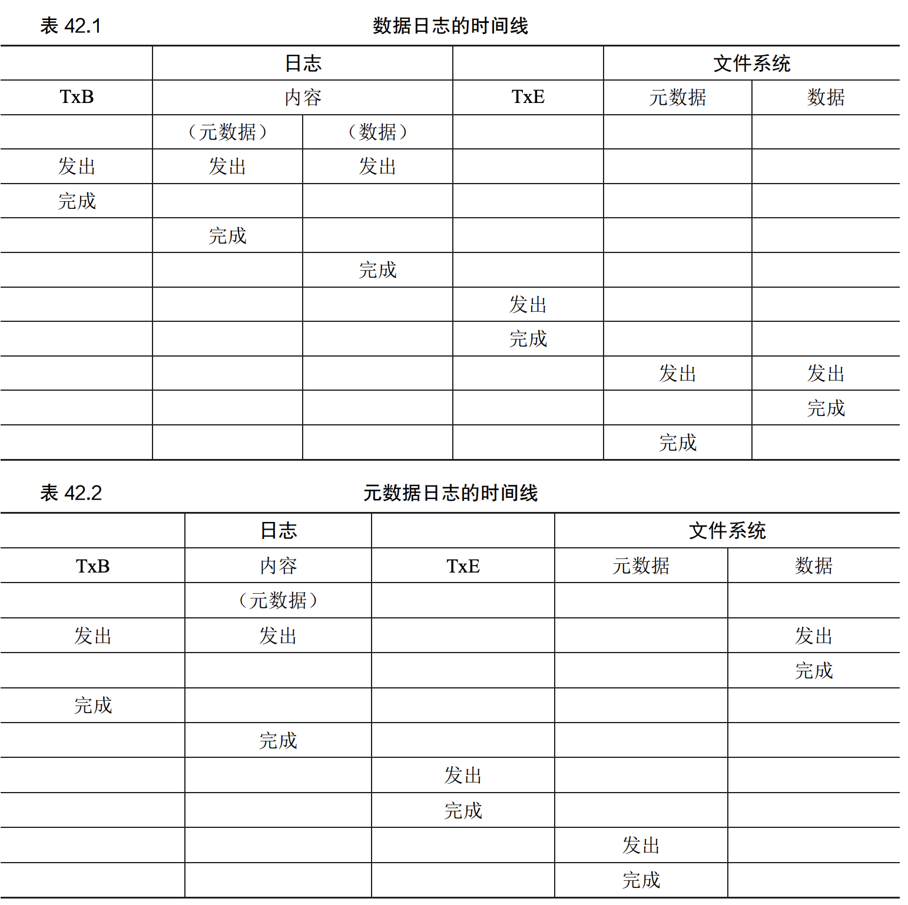

:::tip
文件系统面临一个挑战，如果在出现断电或者系统崩溃的时候，正确的持久化数据，这个被称为崩溃一致性问题。
举例子来说，为了完成特定操作，必须要更新两个磁盘上的结构A和B。由于磁盘一次只能为一个请求服务，因此其中一个请求将首先到达磁盘，如果在一次写入完成
后系统崩溃或者断电，则磁盘上的结构将处于不一致的状态，类似于数据库中的事务所解决的问题。本文主要讲解两个解决该问题的方法，1.文件系统检查程序，
2.日志记录。
:::

## 一个小例子

如图所示，使用标准的简单文件系统，现在该文件包括一个inode位图，一个data位图、一个inode以及一个数据块，假设需要一种工作负载：将单个数据块附加在
原有文件。通过打开文件，调用lssk()将文件偏移量移动到文件末尾，然后在关闭文件之前，向文件发出单个4kB写入来完成追加。  
在向文件追加内容时，要向它添加一个数据块，因此必须更新3个磁盘上的结构：inode（必须指向新块，并且由于追加了新块而具有更大的大小），新数据块Db和
新版本的数据位图（表示新数据已经被分配）。
要实现这种转变，文件系统要对磁盘进行3次单独的写入。**请注意，当用户发出write系统调用时，这些写操作通常不会立即发生。** 脏的inode、位图和新数据
先在内存（页面缓存，page cache，或者缓冲区缓存，buffer cache）中存在一段时间。然后当文件系统决定要写入磁盘时（比如说5s或者30s），将发出必要
的写入请求。遗憾的是，可能会发生崩溃，从而干扰磁盘的更新。特别是，如果这些请求中的一个或者两个完成后发生崩溃，而不是全部三个，则文件系统会处于中间
状态，这是我们要极力避免的。
### 崩溃场景  
根据上面的例子，当系统崩溃时，会出现以下6中中间状态：  
* 只有一次写入成功
1. 只将数据块写入磁盘。
2. 只将更新的inode写入磁盘。
3. 只将更新的位图写入磁盘；
* 两次写入成功
1. inode和位图成功。
2. inode和数据块成功
3. 位图和数据块成功。
### 崩溃一致性问题
从上面提到的场景中可以发现，由于崩溃导致磁盘文件映像可能出现的许多问题：文件系统数据结构中可能存在不一致性。可能时空间泄露，可能是将垃圾数据返回给
用户，等等。正确的做法应该时从一个状态原子地转移到另一个状态（和数据库中事务一样）。然而这并不容易，因为磁盘一次只能提交一次写入，而这些更新之间可能会
发生崩溃或者断电，我们称这种一般问题为崩溃一致性问题。
## 解决方案1：文件系统检查程序
这是早期文件系统采用的一种简单方法来解决崩溃一致性问题。它们先让不一致的事情发生，然后再修复他们（重启时）。但是这种方法无法解决所有的问题。例如：
文件系统开起来一致（inode和数据位图一致），但是inode指向了垃圾数据。唯一目标是确保文件系统元数据内部一致。检查程序是在文件系统挂载并可用之前运行。
一旦完成，磁盘上的文件系统应该是一致的，因为可以让用户访问。它主要会检查以下内容：  
* 超级块
* 空闲块
* inode状态
* inode链接
* 重复
* 坏块
* 目录检查  

这种解决方案有一些缺点：
1. 构建这样的检查程序需要复杂的文件系统知识，确保程序可以在所有情况下都能正常工作；
2. 速度太慢了。因为需要扫描整个磁盘，以查找所有以分配的块并读取整个目录树，对于非常大的磁盘，可能需要几分钟或几小时，随着磁盘容量的增长和RAID的普及，
性能变得令人望而却步，考虑上面的示例，仅需要修复三个块就需要扫描整个磁盘，这种前提也是不合理的；
## 解决方案2： 日志（或预写日志）
这是最流行的解决方案，可能是借鉴于数据库管理系统，日志解决方案是为了解决这类问题而发明的。基本思路：在更新磁盘时，在覆写结构之前，首先写一点小注解
（在磁盘上的其他地方，一个众所周知的地方），描述我们将要做的事情。写下这个注记就是『预写』部分，我们把它写进一个结构，并组织成日志。因此就有了预写日志。
通过将日志写进磁盘，当正在更新期间发生系统崩溃，能够返回并查看日志，然后重试，而不必扫描整个磁盘。通过遮阳的设计，日志在更新期间增加了一些工作量，从而大大
减少恢复期间的工作量。  
  
上图描述了Linux ext3（一种流行的日志文件系统）如何将日志记录到文件系统中。它在ext2的基础上增加了Journal（日志）的空间。
### 数据日志
数据日志作为Linux ext3文件系统的一种模式提供，我们基于此场景进行讨论。  
我们假设进行标准的更新，我们系统将inode、位图和数据块写入磁盘。在将它们写入最终磁盘位置之前，先将它们写入日志。日志的结构如下图所示：
  
一共包含五个块。事务开始（TxB）描述此次更新的信息，包括对文件系统即将进行的更新的相关信息（例如，三个更新块的最终地址），以及某种事务标识符（TID）。
中间三个块只包含块本身的确切内容，这被称为物理日志，因为我们将更新的确切内容放到了日志中。另一个想法是逻辑日志，在日志中放置更紧凑的更新逻辑表示，
例如，『这次更新希望将数据块Db追加到文件X』，这有点复杂，但可以节省日志空间，并可能提高性能。最后一个块（TxE）是该事务结束的标记，也包含TID。
一旦这个事务安全地存在于磁盘上，我们就可以覆写文件系统的旧结构了。这个过程称之为加检查点（实际上就是记完日志之后开始具体实施更新操作）。因此，我们
的具体操作步骤如下：  
1. 日志写入
2. 加检查点  

但是还是面临一个问题：如果在写入日志期间发生崩溃呢？在这里，我们试图将事务中的这些块写入磁盘。一种简单的方法是一次发出一个，等待每个完成，然后发出下一个。
但是这很慢，我们希望一次发出五个块的写入，因为这会将五个写入转化为顺序写入，因此更快。但是这是不安全的，原因是：如此大的写入，磁盘内部可以执行调度并已
任何顺序完成大批写入的小块。因此磁盘内部可以先写入TxB,I[v2],B[v2]和TxE，然后才写入Db。不幸的话，如果磁盘在这个过程中断电，就会变成：  
  
当发生这样的意外，事务看起来还是一个有效的事务，但是文件系统无法查看第四块并知道它是错误的。毕竟，它是任意用户的数据。因此，如果系统现在重新启动并
运行恢复，它将重放此事务，并无知地将垃圾块『？？』的内容复制到了Db应该存放的地方。这对文件中的用户数据不利。如果发生在文件系统的关键部分上，例如
超级块，可能会导致文件系统无法装载。  
为了避免该问题，文件系统分两步发出事务写入。首先将除了TxE块之外的所有块写入日志，当这些写入完成时，文件系统会发出TxE块的写入，从而使日志处于最终安全状态。
因此最终更新的步骤如下：  
1. 日志写入（除去TxE）
2. 日志提交（写入TxE）
3. 加检查点  

### 恢复  
现在了解一下文件系统是如何利用日志进行恢复的。如果崩溃发生在事务被安全地写入日志之前（日志提交之前），那么工作就很简单：简单跳过待执行的更新，不进行
任何操作。如果在日志提交和加检查点之间崩溃，则在系统引导时，文件系统将扫描日志，查找已提交到磁盘的事务。然后这些事务被重放进行磁盘的恢复更新，这被
称为重做日志。

### 批处理日志
上面这种基本的协议会增加大量的额外磁盘流量，因为有频繁的日志写入。为了解决这个问题，一些文件系统不会一次一个向磁盘提交每个更新（例如：Linux ext3）
。可以将所有的更新缓存到全局事务中。当更新文件时，文件系统只将内存的相关数据标记为脏，并将它们添加到快列表中，形成当前的事务。当最后应该将这些块
写入磁盘时，会提交包含上述所有更新的单个全局事务。因此，通过缓存更新；文件系统可以在许多情况下避免对磁盘过多地写入流量。

### 日志有限
应该可以想到，存放日志的空间是有限的。如果不断添加事务，它很快被填满。被填满会出现两个问题：日志越大，恢复时间越长；不能向磁盘提交进一步的事务。  
为了解决这个问题，日志文件系统将日志视为循环数据结构，重复使用。一旦事务被加检查点，文件系统应释放它在日志中占用的空间，允许重用日志空间。有很多
方法可以打到这个目的，比如在日志超级块中标记日志中最旧和最新的事务。所有其他空间都是空闲的。如下图所示：  
  
因此，我们在基本协议中添加了另一个步骤：  
1. 日志写入
2. 日志提交
3. 加检查点
4. 释放
但是我们还面临一个问题：我们将数据块写入了磁盘两次，一次是日志，一次是加检查点。这是很高的成本，下面来讲解如果解决这个问题。  

### 元数据日志
上述描述的日志模式称为数据日志（日志中保存用户数据），另一种更简单的日志形式是元数据日志，它和元数据日志基本一样，只是没有将用户数据写入日志，如
下图所示：  
 
先前写入日志的数据块Db将改为写入文件系统，避免额外写入。考虑到磁盘的大多数IO流量是数据，这样优化将大大减少日志的IO负载。那么什么时候写入数据块呢？
如果在日志写入之后，文件系统可以保证是一致的，但是I[v2]可能最终指向垃圾数据，因为日志中没有存放用户数据，所以重放日志只能生成一致的文件系统，但是
确指向了垃圾数据。为了确保不出现这样的问题，再将相关元数据写入磁盘之前，一些文件系统（Linux ext3）先将数据块写入磁盘，具体来说，包括以下几步：
1. 数据写入：等待完成。
2. 日志元数据写入： 等待写入完成。
3. 日志提交：等待写完成。
4. 加检查点
5. 释放

### 总结日志：时间线
  

## 小结
介绍了崩溃一致性的问题，讨论了处理这个问题的各种方法。检查程序有效但是太慢，目前大部分系统都是使用日志。我们还看到日志包括多种形式，最常用的是有序
元数据日志，可以减少日志数据量，同时可以保证文件系统元数据和用户数据的一致性。

## 参考
[操作系统导论——第42章](https://pages.cs.wisc.edu/~remzi/OSTEP/Chinese/42.pdf)

  

